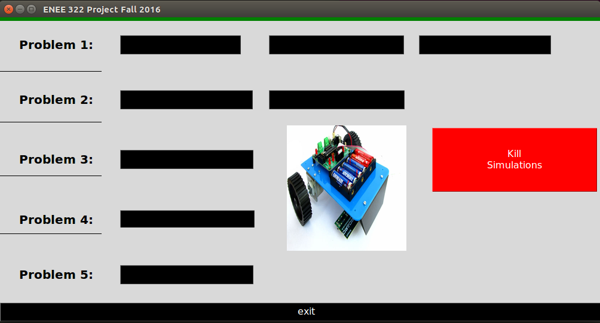

# RobotFollowLeader
Synchronous Robot Movement Patterns
___________________________________________

___________________________________________
#Buttons

##Kill Simulations (Red Button, right side)

##exit (Black Button, at bottom)

##Problem 1: 

###- Braking
###- Rotating, Accelerating
###- Turning, Accelerating

##Problem 2:

###- Closed Loop Control
###- Closed Loop (Multiple Robots)

##Problem 3:

###- Interpolation Target Pose Trajectory

##Problem 4:

###- Two Robots in Line Formation

##Problem 5:

###- N robots in Line Formation

